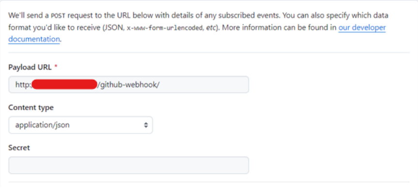

</br>
<div align="center">
  <a href="https://git.io/typing-svg">
    
  </a>
</div>
</br>
<p align="center">

</p>

</br>

# 목차
[0. Dev Git Repository](#0-Dev-Git-Repository)</br></br>
[1. 프로젝트 개요](#1-프로젝트-개요)</br></br>
[2. 팀 소개](#2-팀-소개)</br></br>
[3. 기술 스택](#3-기술-스택)</br></br>
[4. WBS](#4-WBS)</br></br>
[5. 시스템 아키텍쳐](#5-시스템-아키텍쳐)</br></br>
[6. 요구사항 명세서](#6-요구사항-명세서)</br></br>
[7. ERD](#7-ERD)</br></br>
[8. API 명세서](#8-API-명세서)</br></br>
[9. 화면설계서](#9-화면설계서)</br></br>
[10. CI/CD 계획서](#10-CI/CD-계획서)</br></br>
[11. 단위 테스트](#11-단위-테스트)</br></br>
[12. UI/UX 단위 테스트](#12-UI/UX-단위-테스트)</br></br>
[13. 통합 테스트](#13-통합-테스트)</br></br>

<br/>
<br/>

># 0. Dev Git Repository
* [**Backend Repository**](https://github.com/nbbb9/be05-fin-OutPick_Backend)

* [**Frontend Repository**](https://github.com/nbbb9/be05-fin-OutPick_Frontend)

<br/>
   
># 1. 프로젝트 개요
[**문서로 이동**](https://docs.google.com/document/d/e/2PACX-1vRXz16qsa14AtSS3hxbLGdLOLyV3ECUonP_XV0TXHLME7rUtETutvjESXsBJSGwxA/pub)

<details>
<summary>프로젝트 개요</summary>
<div markdown="1">
<div>
</br>
   2024년 현재, 기업 운영의 범위는 더욱 광범위해지고 규모가 커져가고있다. 이러한 상황에서 넓은 범위의 분야를 포괄하고, 가장 중요시되는 것이 '영업관리'이다. 기업 운영에서 중요하게 여겨지는 영업관리이지만, 기존 영업 관리 시스템은 사용자 친화적이지 않다. 따라서 기존보다 효율적이며 유연성 있는 영업관리 시스템이 필요하다. 이 부분이 영업관리 주제를 선택한 이유이자, 앞으로 프로젝트를 진행하면서 중점적으로 개선하여 개발할 부분이다.<br/>
많은 분야의 기업 영업관리가 있지만, 그 중 선택한 분야는 의류 브랜드이다. 의류 브랜드 영업관리를 선택한 이유에는 몇가지가 있다.
   <br/>
   <br/>

<p align="center">

</p>

    "올해 한국 패션시장규모 5.2% 성장해 49.5조" 나지현 기자 Ktnews
</br>
첫번째, 시장의 수요이다. 인간이 살아가면서 가장 중요하고 필요한 요소들 중 하나가 바로 의류이다. 인간이 현존하는 동안에는 의류 산업은 필수적이다. 또한 인류 사회가 발전함에 따라 의류는 단순한 옷, 그 자체가 아닌 자신의 개성을 드러낼 수 있는 패션 수단으로써 시장의 규모가 더욱 커지고있다.<br/><br/>
두번째, 트렌드의 영향이다. 위에서 말했듯이 의류는 개성을 드러내는 패션 수단으로 발전했다. 이에 따라서 의류 산업은 트렌드의 영향을 많이 받게되는 산업 중 하나인데, 이러한 트렌드에 맞춰서 효율적이고 유연성 있게 영업을 관리할 수 있는 시스템이 필요하다고 판단했다.<br/><br/>
세번째, 경쟁력이다. 유연하고 효율적인 영업 관리를 한다면 빠르게 대응해야하는 의류 브랜드 산업에서는 큰 경쟁력을 가질 수 있게 될 것이다. 기존보다 더 효율적이고 친화적인 UI, 트렌드에 빠른 대응을 할 수 있도록 돕는 트렌드에 대한 정보 제공 등을 활용한다면 다른 영업관리 시스템에 비해서 더욱 경쟁력을 가진 영업관리 시스템이 될 것이라고 생각했다.<br/><br/>
위와 같은 내용을 바탕으로 '의류 브랜드 산업 영업 관리 시스템'을 최종 주제로 선정하였다. 해당 프로젝트는 영업관리의 중 재고, 유통 관리 일부분을 구현하였고, 배포하는 과정의 내용을 중점적으로 다루었다.
</div>
</details>
<br/>
<br/>

># 2. 팀 소개

<div align="center">

||||||
|:-:|:-:|:-:|:-:|:-:|
|[**박혜경**](https://github.com/BakHyegyeong)|[**여경원**](https://github.com/kyungwon2won2)|[**이영원**](https://github.com/nbbb9)|[**정설화**](https://github.com/Noononda)|[**백승호**](https://github.com/sttoend)|

</div>


</br>
</br>

># 3. 기술 스택
* **Database :**
<br/></br>
* **Backend   :** <br/></br>
* **Frontend :** <br/><br>
* **CI/CD :**    

</br>
</br>

># 4. WBS
**Jira를 사용한 WBS**
</br>
<p align="center">

</p>

<br/>
<br/>

># 5. 시스템 아키텍쳐

<p align="center">

</p>

</br>
</br>

># 6. 요구사항 명세서
[**문서로 이동**](https://docs.google.com/spreadsheets/d/e/2PACX-1vS9bODOt-rtBDKpbaG0ATOLsyy8J1jfMzSeBrBA_it37OxoHOSj3OC0gWU_MUZBrk95X8eXk6qHYQHk/pubhtml?gid=1317833348&single=true)
</br>
<p align="center">

</p>

<br/>
<br/>

># 7. ERD
**ERD Cloud를 통한 ERD 제작**
</br>
<p align="center">

</p>

<br/>
<br/>

># 8. API 명세서
[**문서로 이동**](https://docs.google.com/spreadsheets/d/e/2PACX-1vS9bODOt-rtBDKpbaG0ATOLsyy8J1jfMzSeBrBA_it37OxoHOSj3OC0gWU_MUZBrk95X8eXk6qHYQHk/pubhtml?gid=153264304&single=true)
</br>
<p align="center">

</p>

<br/>
<br/>

># 9. 화면설계서
[**Figma 바로가기**](https://www.figma.com/design/wi8ajLQUWntGToZKFLz77M/Untitled?node-id=0%3A1&t=s3S2rUalCspQz62l-1)
</br>
<p align="center">

</p>

<br/>
<br/>

># 10. CI/CD 계획서
<details>
<summary>내용 자세히</summary>

### 1. Devops tool : Jenkins
     지속적 통합 및 지속적 배포(CI/CD) 파이프라인을 자동화하기 위한 오픈소스 자동화 서버이다.

#### * 장점 
    1) 지속적인 통합 및 지속적인 전달
         : Git과 같은 버전관리시스템과 연동하여 코드 변경 사항을 감지하고, 자동화 테스트를 포함한 빌드를 수행하여 
           소프트웨어 품질을 향상시킬 수 있다. 이로써 개인이 미처실시하지 못한 테스트까지도 수행할 수 있다.

    2) 다양한 활용 및 손쉬운 확장
         : 1500개 이상의 플러그인을 통해서 Git, AWS 등의 도구와 쉽게 통합해 사용할 수 있으며 많은 참고 자료가 있어 
           문제 해결이나 새로운 기능 구현에 대한 정보를 쉽게 얻을 수 있다.
        
    3) 편리한 설정
         : 웹 기반의 콘솔로 다양한 인증 기반과 결합하여 권한 관리 기능을 제공해 안전한 빌드 및 배포 환경을 구축할 수 있다. 
           또한 수많은 플러그인을 사용해 반복되는 작업을 최소화할 수 있다.

#### * GitHub Actions VS Jenkins
    1) 직관적인 UI
         : 저희 프로젝트에서는 Vue 서버와 Spring 서버 각각을 CI, CD해야했기에 이를 한번에 관리할 수 있는 도구가 필요했다.
           Jenkins의 경우 메인 화면에서 build가 어디서 이루어지고 있는지 확인할 수 있어 테스트를 진행할 때 번거로움이 
           줄어들 것이라 생각했다.

    2) 유연한 파이프라인을 통한 커스터마이징
         : GitHub Actions에 비해 Jenkins는 다양한 플러그인과 파이프라인 스크립트를 통해 사용자의 커스터마이징이 자유롭고, 
           복잡한 빌드 및 배포 과정을 유연하게 정의할 수 있다. 이는 아직 AWS를 제대로 공부하지 않은 상태이기에 발생할 수 
           있는 변수를 제어하기 더 쉬울 것이라 생각했다

[https://inpa.tistory.com/entry/Jenkins-%F0%9F%93%9A-%EC%A0%A0%ED%82%A8%EC%8A%A4%EB%9E%80-%EB%AC%B4%EC%97%87%EC%9D%B8%EA%B0%80] Jenkins – 자동화 테스트

[https://velog.io/@tjseocld/CI-CD-%EC%99%80-Jenkins] Jenkins – 특징

[https://www.jenkins.io/] Jenkins – 정의

[https://velog.io/@kimseungki94/Jenkins-vs-Github-Action-%EC%96%B4%EB%96%A4%EA%B1%B8-%EC%93%B0%EB%8A%94%EA%B2%8C-%EC%A2%8B%EC%9D%84%EA%B9%8C] Jenkins vs Github Action

### 2. 배포 과정

    1) Backend 배포 과정
      : git pull request → webhook → Jenkins → AWS S3에 빌드 파일 업로드 → Codedeploy를 통한 배포 → ec2 안에 서버 개시

    2) Frontend 배포 과정
      : git pull request → webhook → Jenkins → AWS S3에 빌드 파일 업로드 → AWS S3의 정적 웹 사이트 호스팅
       
       
    ( AWS S3와 AWS RDS는 당연히 써야하기에 패스! )

### 3. AWS CloudFront

    콘텐츠 전송 네트워크(CDN) 서비스로, 클라이언트의 콘텐츠 요청 시 서버에서 받아온 콘텐츠를 Edge Location에 캐싱하고,
    이후 같은 요청이 왔을 때, 가장 가까운 Edge Location에서 캐싱된 데이터를 제공한다.

#### * 장점
    - 서버 성능 향상
        : 컨텐츠를 제공하는 서버와 실제 요청 지점 간의 지리적 거리가 매우 먼 경우나 통신 환경이 좋지 않은 경우,
          요청지점의 CDN을 통해 빠르게 컨텐츠를 제공할 수 있다. 이 과정 속에서 서버의 직접적인 요청이 필요 없기 때문에 
          서버의 부하를 줄일 수 있다.

    - 데이터 전송 속도 향상
        : 캐싱을 통해 사용자가 서버의 요청 없이 바로 데이터를 얻을 수 있어 접근 속도가 빨라진다. 이는 특히 대용량 
          파일 전송이나 스트리밍 서비스 등에서 큰 장점을 제공한다.
    
    - 보안
        : 특정 지역의 컨텐츠 접근을 제한할 수 있으며, SSL/TLS 암호화를 통해 데이터 전송 중에 보안을 강화할 수 있다.
          또한 원본 서버의 직접적인 IP주소 노출을 막아 해킹 시도 시 공격자가 서버를 직접 타겟팅하기 어렵게 만든다.
    
    - 확장성과 가용성
        : 트래픽이 급증하더라도 자동으로 확장되어 안정적인 서비스 제공이 가능하다. 대규모 이벤트나 프로모션 기간에도 
          안정적인 콘텐츠 제공이 가능하며, 예상치 못한 트래픽 증가에도 유연하게 대응할 수 있다.
    
    - 다양한 통합 기능
        : AWS의 다른 서비스와 원활하게 통합되어 다양한 기능을 제공한다. s3, ec2와 같은 서비스와 연동하여 효율적인 콘텐츠 
          제공을 구현할 수 있다.

#### * 선택 이유
    - 데이터 전송 속도 향상
        : 우리 서버의 더미 데이터는 20만 개가 넘어간다. 이로 인해 통계를 도출할 때 10초가 넘는 지연시간이 발생한다.
          이러한 경험이 반복될수록 사용자에게 불쾌감을 줄 수 있기에, 이를 AWS CloudFront를 통해 해결할 수 있었다.
 `localhost`
 `AWS CloudFront` 
    
    → AWS CloudFront 부분의 성능 부분이 눈에 띄게 좋아진 것을 확인할 수 있다.

    - 보안
        : 학원에서 제공된 계정이기에 사용할 수 있는 금액이 제한되어 있다. 그렇기에 금액 부분에서 더욱 신중할 수 밖에
          없었다. 이에 직접적인 IP 노출을 막고 한국이 아닌 다른 나라의 접속을 차단하는 cloudfront는 효과적인 대안이라고
          생각했다.

[https://inpa.tistory.com/entry/AWS-%F0%9F%93%9A-CloudFront-%EA%B0%9C%EB%85%90-%EC%9B%90%EB%A6%AC-%EC%82%AC%EC%9A%A9-%EC%84%B8%ED%8C%85-%F0%9F%92%AF-%EC%A0%95%EB%A6%AC] cloudfront 장점

[https://bosungtea9416.tistory.com/entry/AWS-CloudFront] cloudfront 기능 소개

[https://mmsesang.tistory.com/entry/%EC%9B%B9-%EC%84%B1%EB%8A%A5%EC%9D%84-%EC%B8%A1%EC%A0%95%ED%95%98%EB%8A%94-%EB%8F%84%EA%B5%AC%EB%93%A4] 웹 성능 테스트

### 4. AWS CodeDeoloy
    코드, 웹 및 구성파일, 패키지, 스크립트 등의 애플리케이션 콘텐츠를 운영환경에 자동으로 배포하는 역할을 수행하는 
    AWS 서비스이다.

#### * 장점
    - 배포 자동화 및 모니터링
        : AWS CodeDeploy는 애플리케이션 배포 과정을 자동화하여 수동 작업의 필요성을 줄인다. 배포 과정 중 발생하는 문제를
          실시간으로 모니터링하고, 오류가 발생하면 자동으로 롤백하여 안정성을 보장한다.

    - 가동 중지 시간 최소화 
        : CodeDeploy는 블루-그린 배포, 롤링 배포와 같은 다양한 배포 전략을 지원하여 애플리케이션 가동 중지 시간을
          최소화한다. 이를 통해 사용자는 서비스 중단 없이 새로운 기능을 배포할 수 있다.

    - 쉬운 접근 
        : AWS Management Console, CLI 및 SDK를 통해 쉽게 접근하고 사용할 수 있다. 이를 통해 사용자는 손쉽게 배포 작업을
          설정하고 관리할 수 있다.

#### * Docker VS CodeDeploy
    CodeDeploy는 AWS에서 제공하고 있는 서비스이므로 AWS의 다른 서비스(AWS S3, AWS ec2) 등에서 다른 프로그램을 연결하지
    않더라도 AWS 내에서 효율적이고 편리한 배포가 가능하다. 
    Docker를 사용할 경우 Docker 계정을 생성하고, 각 컨테이너를 생성하며, Dockerfile을 작성하는 등의 추가 작업이 필요하다. 
    반면에 CodeDeploy는 Docker의 이런 복잡한 과정을 단순화하여 AWS 환경 내에서 쉽게 배포 작업을 진행할 수 있다.
    게다가 Jenkins와 AWS s3를 이미 파이프라인 스크립트로 연결하고 있었기에 CodeDeploy를 사용하는 것이 더 접근성이 좋다. CodeDeploy가 AWS의 다른 서비스들과 자연스럽게 통합되기 때문이다. CodeDeploy의 경우 S3에 저장된 애플리케이션 
    패키지를 자동으로 배포할 수 있어 별도의 설정 없이도 쉽게 배포 작업을 수행할 수 있다.

    → 따라서 AWS 환경에서 애플리케이션을 배포할 경우 Docker보다는 CodeDeploy가 더 효율적인 선택이라 판단하였다.

### 5. 배포

` 1. 백엔드 - appspec.yml `


</br>

` 2. 백엔드 - Scripts/cleanup_sh `


</br>

` 3. 백엔드 - Scripts/stop.sh `


</br>

` 4. 백엔드 - Scripts/start.sh `


</br>

` 5. webhook 설정 `



</br>

` 6. Jenkins Credentials `

<!--  -->


</br>

` 7. Jenkins Plugins `

 <br> → AWS 의 액세스 키로 Credentials 를 생성하기 위한 플러그인

 <br> → Github Pull Request 만 알림 받기 위한 플러그인

</br>

` 8. Jenkins Item 생성 `

 <br> → 프론트 엔드와 백엔드 Item 생성

<br/>

` 9. 각 Item 별 파이프라인 `

<details>
<summary>Frontend Pipeline</summary>
<div markdown="1">
    
```pipeline
pipeline {
    
    agent any
    tools {
        nodejs "node16"
        git "Default"
    }
    
    stages{
        
        stage('Prepare'){
            steps{
                sh "node -v"
                sh "npm -v"
                // sh "npm install --save"
                sh "npm install @vue/cli"
                sh "pwd"
            }
        }

        stage('Build'){
            
            steps{
                // Build 영역 : Git 연동
                git branch : 'main', // 후에 각각의 branch로 설정
                    credentialsId : 'jenkins_github_connect',
                    url : 'https://github.com/nbbb9/be05-fin-OutPick_Frontend.git'
                // sh "npm run build"
                sh "CI=false npm run build"
                echo "build 완료"
            }
    
        }
        stage('deploy'){
            steps{
                withCredentials([[$class: 'AmazonWebServicesCredentialsBinding', credentialsId: 'AWS_configure']]) {
                    sh 'aws s3 ls'
                    sh 'aws configure list'
                    sh "aws s3 sync ./dist s3://outpick"
                    echo "deploy 완료"
                }
            }
        }
        
        stage('Invalidate CloudFront Cache') {
            steps {
                // CloudFront 캐시 무효화 수행
                sh 'aws cloudfront create-invalidation --distribution-id EUP62OSJUG4ID --paths "/*"'
            }
        }
    }
}
```
</div>
</details>

</br>

<details>
<summary>Backend Pipeline</summary>
<div markdown="1">
    
```pipeline
pipeline {
    
    agent any
    
    stages{
        stage('Build And Archive'){
            
            steps{
                // Build 영역 : Git 연동
                git branch : 'main', // 후에 각각의 branch로 설정
                    credentialsId : 'jenkins_github_connect',
                    url : 'https://github.com/nbbb9/be05-fin-OutPick_Backend.git'
                echo 'git hook!'
                
                // Build 영역 : pjt build
                sh 'chmod +x ./gradlew'
                sh './gradlew build'
                
                // Build 영역 : 압축축
                sh 'cp appspec.yml build/'  // appspec.yml을 압축 파일에 추가
                sh 'cp -r scripts build/'   // scripts폴더를 압축 파일에 추가
                sh 'zip -r build/archive.zip build/libs/* build/appspec.yml build/scripts/'
                echo 'build and archive completed!'
            }
    
        }
        
        stage('Upload to S3') {
            steps {
                // s3에 업로드드
                withCredentials([[$class: 'AmazonWebServicesCredentialsBinding', credentialsId: 'AWS_configure']]) {
                    sh 'aws s3 cp build/archive.zip s3://outpick/archive.zip --region ap-northeast-2'
                }
            }
        }
        
        stage('Deploy to EC2') {
            steps {
                // deploy에 요청을 보내 ec2에 배포포
                withCredentials([[$class: 'AmazonWebServicesCredentialsBinding', credentialsId: 'AWS_Iam_Jenkins']]) {
                    script {
                        def bucket = 'outpick'
                        def key = "archive.zip"
                        def applicationName = 'outpick-codedeploy'
                        def deploymentGroupName = 'outpick-codedeploy-group'
                        def region = 'ap-northeast-2'
        
                        // AWS CLI를 사용하여 CodeDeploy 배포 생성
                        sh """
                        aws deploy create-deployment \\
                            --application-name ${applicationName} \\
                            --deployment-group-name ${deploymentGroupName} \\
                            --s3-location bucket=${bucket},bundleType=zip,key=${key} \\
                            --region ${region}
                        """
                    }
                }
            }
        }

    }
}
```
</div>
</details>

</br>

` 10. Frontend `

    - Github Pull Request
    - Jenkins 자동 build + S3 배포 진행 + S3 캐시 초기화


    - S3 업로드 내역


</br>

` 11. Backend `

    - Github Pull Request
    - Jenkins 자동 build + S3 업로드 진행 + CodeDeploy를 통한 ec2 배포 진행 


    - s3 업로드 내역


    - CodeDeploy 배포


</details>

</br>
</br>

># 11. 단위 테스트

<details>
<summary>본사 프로그램</summary>

#### 1. 로그인
> 사번과 비밀번호 입력을 통해 로그인할 수 있다.

<p align="center">

</p>

<p align="center">

</p>

#### 2. 로그인한 사원의 정보 조회
> 로그인한 사원 본인의 사원 정보를 불러와서 인포윈도우에서 확인할 수 있다.

<p align="center">

</p>

<p align="center">

</p>

#### 3. 관리자 _ 전체 영업사원 리스트 조회
> 관리자는 전체 영업사원을 리스트로 확인할 수 있다.

<p align="center">

</p>

<p align="center">

</p>

#### 4. 관리자 _ 영업사원 상세조회
> 관리자는 전체 영업사원을 상세조회 할 수 있다.

<p align="center">

</p>

<p align="center">

</p>

#### 5. 관리자 _ 영업사원 정보 수정
> 관리자는 전체 영업사원의 상세벙보를 수정할 수 있다.

<p align="center">

</p>

<p align="center">

</p>

#### 6. 관리자 _ 영업사원 판매량 조회
> 관리자는 각 영업사원이 담당한 매장의 특정 년도 월 판매량을 조회할 수 있다.

<p align="center">

</p>

<p align="center">

</p>

#### 7. 관리자 _ 재고요청서 리스트 조회
> 관리자는 영업사원으로 부터 1차 승인된 재고요청서를 리스트로 확인할 수 있다.

<p align="center">

</p>

<p align="center">

</p>

#### 8. 관리자 _ 매장별 재고요청서 리스트 조회
> 관리자는 매장별 재고요청서를 리스트로 확인할 수 있다.

<p align="center">

</p>

<p align="center">

</p>

#### 9. 관리자 _ 재고요청서 상세 조회
> 관리자는 리스트에서 선택한 재고요청서의 상세정보를 확인할 수 있다.

<p align="center">

</p>

<p align="center">

</p>

#### 10 . 관리자 _ 재고요청서 승인
> 관리자는 1차 승인된 재고요청서를 2차(최종) 승인할 수 있다.

<p align="center">

</p>

<p align="center">

</p>

#### 11. 관리자 _ 생산요청서 리스트 조회
> 관리자는 영업사원이 작성한 전체 생산요청서를 리스트로 확인할 수 있다.

<p align="center">

</p>

<p align="center">

</p>

#### 12. 관리자 _ 생산요청서 상세 조회
> 관리자는 전체 생산요청서의 상세 정보를 확인할 수 있다.

<p align="center">

</p>

<p align="center">

</p>

#### 13. 관리자 _ 생산요청서 승인
> 관리자는 생산요청서를 승인할 수 있다.

<p align="center">

</p>

<p align="center">

</p>

#### 14. 통계/분석 _ 년도별 월 판매량 & 매출 조회
> 회사의 특정 년도 월별 판매량과 매출을 조회할 수 있다.

<p align="center">

</p>

<p align="center">

</p>

#### 15. 통계/분석 _ 년도&월 별 매장의 판매량 & 매출 조회
> 특정 년도, 월별 매장의 판매량과 매출을 조회할 수 있다.

<p align="center">

</p>

<p align="center">

</p>

#### 16. 통계/분석 _ 1차 분류 판매량
> 특정 년도의 계절별 카테고리, 색상, 핏의 판매량을 조회할 수 있다.

<p align="center">

</p>

<p align="center">

</p>

#### 17. 통계/분석 _ 2차 분류 판매량
> 특정 년도의 핏별 계절, 카테고리의 판매량을 조회할 수 있다.

<p align="center">

</p>

<p align="center">

</p>

#### 18. 통계/분석 _ 가격별 판매량
> 특정 년도 특정 매장의 가격별 판매량을 조회할 수 있다.

<p align="center">

</p>

<p align="center">

</p>

#### 19. 통계/분석 _ 매장별 특정 상품 판매량
> 재고요청서 상세보기에서 매장의 특정 상품 연간 판매량을 조회할 수 있다.

<p align="center">

</p>

<p align="center">

</p>

#### 20. 통계/분석 _ 판매량 내림차순 조회
> 특정 매장의 상품들을 판매량이 높은 순서대로 조회할 수 있다.

<p align="center">

</p>

<p align="center">

</p>

#### 21. 매장 _ 매장 리스트 조회
> 전체 매장을 리스트로 조회할 수 있다.

<p align="center">

</p>

#### 22. 매장 _ 담당 매장 리스트 조회
> 로그인한 영업사원이 담당하는 매장을 리스트로 조회할 수 있다.

<p align="center">

</p>

<p align="center">

</p>

#### 23. 매장 _ 담당 매장 상세 조회
> 로그인한 영업사원이 담당하는 매장을 상세조회 할 수 있다.

<p align="center">

</p>

<p align="center">

</p>

#### 24. 재고요청서 _ 재고요청서 리스트 조회
> 매장들의 재고요청서를 리스트로 확인할 수 있다.

<p align="center">

</p>

<p align="center">

</p>

#### 25. 재고요청서 _ 재고요청서 상세조회
> 매장들의 재고요청서 상세 정보를 확인할 수 있다.

<p align="center">

</p>

<p align="center">

</p>

#### 26. 재고요청서 _ 재고요청서 1차 승인
> 일반사원은 담당 매장의 재고요청서에 대해 1차 승인할 수 있다.

<p align="center">

</p>

<p align="center">

</p>

#### 27. 재고요청서 _ 재고요청서 반려 & 피드백 작성
> 일반사원은 담당 매장의 재고요청서에 대해 피드백 작성과 함께 반려할 수 있다.

<p align="center">

</p>

<p align="center">

</p>

#### 28. 건의문 _ 건의문 리스트 조회
> 매장들의 건의문을 리스트로 확인할 수 있다.

<p align="center">

</p>

<p align="center">

</p>

#### 29. 건의문 _ 건의문 상세조회
> 로그인한 영업사원이 담당하는 매장들의 건의문 상세 정보를 확인할 수 있다.

<p align="center">

</p>

<p align="center">

</p>

#### 30. 건의문 _ 건의문 해결방안 작성
> 로그인한 영업사원이 담당하는 매장들의 건의문에 대해 해결방안을 작성할 수 있다.


#### 31. 건의문 _ 건의문 선택조회
> 로그인한 영업사원이 담담하고 있는 매장들 중 특정 매장의 건의문 전체리스트를 조회할 수 있다.


<사진>


#### 32. 건의문 _ 해결방안 수정
> 로그인한 영업사원이 담당하고 있는 매장들의 건의문의 해결 방안을 수정할 수 있다.


#### 33. 건의문 _ 건의문 해결완료
> 로그인한 영업사원이 담당하고 있는 매장들의 건의문에 해결완료 처리를 할 수 있다. 


#### 34. 할인율 적용(수정)
> 상품의 할인율을 적용(수정)할 수 있다.(default = 0)


#### 35. 매장 재고 리스트 조회
> 매장의 상품 재고를 리스트로 확인할 수 있다.


#### 36. 회사 재고 리스트 조회
> 본사 창고의 재고를 리스트로 조회할 수 있다.


#### 37. 생산요청서 _ 생산요청서 리스트 조회
> 로그인한 영업사원이 본인이 작성한 생산요청서를 리스트로 조회할 수 있다.


#### 38. 생산요청서 _ 생산요청서 상세 조회
> 생산요청서의 리스트에서 선택한 생산요청서의 상세정보를 조회할 수 있다.


#### 39. 생산요청서 _ 생산요청서 수정
> 로그인한 영업사원이 본인이 작성한 생산요청서를 수정할 수 있다.


#### 40. 상품 _ 상품 리스트 조회
> 회사에 등록된 상품을 리스트로 조회할 수 있다.


#### 41. 상품 _ 상품 상세조회
> 각 상품의 상세정보를 조회할 수 있다.


#### 42. 상품 _ 생산요청서 작성
> 재고가 부족해 보이는 상품에 대해서 생산요청서를 작성할 수 있다.


#### 43. 물류센터 리스트 조회
> 물류센터(회사창고)를 리스트로 조회할 수 있다.


</details>

<details>
<summary>매장프로그램</summary>

#### 로그인
> 매장명, 매니저 이메일, 매니저 이름을 입력하여 로그인 할 수있다.

<p align="center">

</p>

<p align="center">

</p>

#### 로그인한 매장의 재고를 리스트로 확인
> 매장아이디를 입력하여 조회할 수있다.

<p align="center">

</p>

<p align="center">

</p>

#### 선택한 재고의 상세정보를 확인
> 재고아이디를 입력하여 조회할 수있다.

<p align="center">

</p>

<p align="center">

</p>

#### 재고요청서 페이지로 이동시 상품의 모든정보를 불러옴
> 입력값 없음.

<p align="center">

</p>

<p align="center">

</p>

#### 재고요청서 작성
> 매장아이디, 상품 아이디, 수량을 입력할 수있다.

<p align="center">

</p>

<p align="center">

</p>

#### 재고요청서 리스트 조회
> 매장 아이디를 입력하여 해당 매장의 매니저가 작성한 재고요청서를 리스트로 확인

<p align="center">

</p>

<p align="center">

</p>

#### 재고요청서의 피드백 상세조회
> 재고요청서 아이디를 입력하여 조회할 수있다.

<p align="center">

</p>

<p align="center">

</p>

#### 판매내역 추가
> 매장아이디, 상품아이디, 수량을 입력할 수있다.

<p align="center">

</p>

<p align="center">

</p>

#### 판매내역 리스트 조회
> 매장아이디를 입력하여 조회할 수있다.

<p align="center">

</p>

<p align="center">

</p>

#### 건의사항 작성
> 매장아이디, 제목, 내용, 카테고리를 입력할 수있다.

<p align="center">

</p>

<p align="center">

</p>

#### 건의사항 리스트 조회
> 매장아이디를 입력하여 조회할 수있다.

<p align="center">

</p>

<p align="center">

</p>

</details>

</br>
</br>

># 12. UI/UX 단위 테스트
<details>
<summary>본사 프로그램 _ 관리자</summary>

### 1. 로그인


### 2. 재고요청서 전체 조회 & 상세 조회


### 3. 건의사항 전체 조회 & 상세 조회


### 4. 매장 재고 전체 조회 & 상세 조회


### 5. 생산요청서 전체 조회 & 상세 조회


### 6. 사원 정보 리스트 조회 & 검색 & 상세 조회


### 7. 사원 정보 수정


### 8. 사원 담당 매장 판매량 조회


### 9. 재고요청서 조회 & 검색 & 분류 & 상세 조회


### 10. 아직!!!!!

<사진>

### 11. 생산요청서 전체 조회 & 상세 조회 & 승인


</details>

<details>
<summary>본사 프로그램 _ 사원 </summary>

### 1. 로그인


### 2. 재고요청서 리스트 조회 & 분류 & 상세 조회


### 3. 재고요청서 승인


### 4. 재고요청서 반려


### 5. 건의사항 리스트 조회 & 상세 조회 & 분류 & 검색


### 6. 건의사항 해결문작성 & 해결완료


### 7. 매장 재고 전체 조회 & 상세 조회 & 검색 & 정렬 & 화면 이동


### 8. 할인율 적용


### 9. 회사 재고 전체 조회 & 상세 조회 & 검색 & 정렬


### 10. 생산요청서 조회 & 수정


### 11. 상품 전체 조회 & 상세 조회 & 검색 & 정렬 & 생산요청서 작성


### 12. 물류센터 전체 조회


### 13. 통계 / 분석


### 14. 알림


### 15. InfoWindow & 로그아웃


</details>

<details>
<summary>매장 프로그램</summary>

### 1. 로그인


### 2. 재고확인


### 3. 재고요청서 작성


### 4. 재고요청서 관리


### 5. 판매 관리


### 6. 건의사항 작성


### 7. 건의사항 관리


### 8. 알림


</details>

</br>
</br>

># 13. 통합 테스트
[**문서로 이동**](https://docs.google.com/spreadsheets/d/e/2PACX-1vS9bODOt-rtBDKpbaG0ATOLsyy8J1jfMzSeBrBA_it37OxoHOSj3OC0gWU_MUZBrk95X8eXk6qHYQHk/pubhtml?gid=343013399&single=true)
</br>

<p align="center">

</p>
